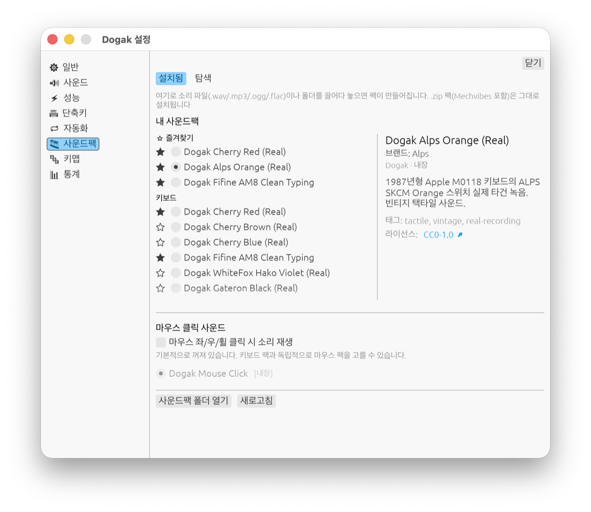

# Dogak (도각)

[](https://github.com/hanej93/dogak-releases)

**노트북 키보드도 기계식 키보드처럼.**

Dogak은 어떤 키보드로 타이핑하든 키를 누르고 떼는 순간에 맞춰 타건음을 내주는 macOS 메뉴바 앱입니다. Cherry MX, ALPS, IBM Model F 같은 실제 키보드 녹음부터 도각거리는 돌과 나무, 바삭한 ASMR 사운드까지 골라 쓸 수 있습니다.

> 현재 비공식 베타입니다. Apple 정식 등록 전이라 처음 설치할 때 macOS 경고를 한 번 풀어야 합니다. 아래 설치 안내를 따라 하면 됩니다.

## 다운로드

**[최신 버전 받기](https://github.com/hanej93/dogak-releases/releases/latest)**

- macOS 12 Monterey 이상
- Apple Silicon 및 Intel Mac 지원

## Dogak에서 할 수 있는 것

### 타건감을 소리로 바꿉니다

- 키를 누를 때와 뗄 때 다른 소리를 냅니다. 스페이스, 엔터, 백스페이스에도 전용 소리를 지정할 수 있습니다.
- 키 위치에 따라 소리가 좌우로 움직이는 공간 음향과 미세한 피치 변조를 지원합니다. 헤드폰으로 들으면 반복 샘플 특유의 기계적인 느낌이 덜합니다.
- 소리를 미리 메모리에 올려두고 재생해 빠르게 타이핑해도 반응이 늦거나 끊기지 않도록 만들었습니다.

### 사운드팩 22종이 들어 있습니다

Cherry MX Red, Brown, Blue, ALPS Orange, IBM Model F, Gateron Black 등 실제 키보드 녹음과 나무, 조약돌, 유리, 얼음, 눈 같은 ASMR 팩을 함께 제공합니다. 자주 쓰는 팩은 즐겨찾기에 올리고 전역 단축키로 바로 넘길 수 있습니다.



내가 가진 음원도 사운드팩으로 쓸 수 있습니다. wav, mp3, ogg, flac 파일이나 폴더를 설정 창에 끌어다 놓으면 Dogak이 길이와 음량을 다듬어 팩을 만듭니다. zip 및 Mechvibes 팩도 가져올 수 있고, 키마다 다른 소리를 배치하거나 여러 키를 한꺼번에 설정할 수도 있습니다.

### 일할 때 방해되지 않게 조절합니다

- 제외할 앱을 지정하면 그 앱을 쓰는 동안 자동으로 소리를 끕니다.
- 회의 자동 뮤트는 현재 베타 기능입니다. 옵션을 켜면 마이크 사용 중에 소리를 멈추고, 마이크 사용이 끝나면 이전 상태로 돌아갑니다.
- 헤드폰을 연결할 때만 자동으로 켜거나, 타건음을 특정 출력 장치로만 보낼 수 있습니다. 가상 오디오 장치를 지정하면 OBS 방송에도 따로 담을 수 있습니다.
- 메뉴바 우클릭이나 전역 단축키로 어느 앱에서든 바로 켜고 끌 수 있습니다.

### 키 입력은 소리를 내는 순간에만 봅니다

Dogak은 키 입력을 관찰만 하며 가로채거나 바꾸지 않습니다. 어떤 글자를 쳤는지 저장하거나 전송하지도 않습니다. 타이핑 통계를 켜면 오늘, 최근 7일, 전체 타수와 최고 연속 타수를 볼 수 있지만 키의 내용은 남기지 않습니다. 통계는 이 Mac에만 보관됩니다. 앱의 네트워크 연결은 업데이트 확인에만 쓰며 설정에서 끌 수 있습니다.

키보드를 닦을 때는 청소 모드로 입력을 잠시 막을 수 있습니다. 5분이 지나면 자동으로 풀려 실수로 켜둔 채 잊어도 괜찮습니다.

## 빠른 사용법

| 하고 싶은 것 | 방법 |
|---|---|
| 소리 켜기 또는 끄기 | 메뉴바 아이콘 우클릭 또는 전역 단축키 |
| 볼륨과 사운드팩 바꾸기 | 메뉴바 아이콘 좌클릭 |
| 사운드팩을 빠르게 넘기기 | 이전 또는 다음 팩 전역 단축키 |
| 세부 설정 열기 | 메뉴바 아이콘 좌클릭 후 `설정…` |
| 내 음원 가져오기 | `설정 > 사운드팩`에 파일이나 폴더 끌어놓기 |

## 설치 방법

### 1. 앱을 응용 프로그램에 넣기

1. 받은 `Dogak-x.y.z.dmg`를 더블클릭해 엽니다.
2. Dogak 아이콘을 옆의 `Applications` 폴더로 드래그합니다.
3. 설치 창을 닫습니다.

### 2. macOS 경고 풀기

정식 등록 전 앱이라 처음 열 때 "확인할 수 없어 열 수 없습니다"라는 경고가 나옵니다.

1. `터미널`을 엽니다. (`⌘ + 스페이스`를 누르고 "터미널" 입력)
2. 아래 명령을 붙여넣고 엔터를 누릅니다.

```bash
xattr -dr com.apple.quarantine /Applications/Dogak.app
```

3. 별도 메시지 없이 다음 입력 줄이 나타나면 완료된 것입니다.

이 명령은 인터넷에서 받은 파일에 macOS가 붙이는 검역 속성만 제거합니다. 앱이나 다른 시스템 설정은 바꾸지 않습니다.

### 3. 실행하고 입력 모니터링 허용하기

1. `응용 프로그램` 폴더에서 Dogak을 실행합니다.
2. 첫 실행 안내에서 `시스템 설정 열기`를 누릅니다.
3. `개인정보 보호 및 보안 > 입력 모니터링`에서 Dogak을 켭니다.

권한을 허용하면 메뉴바에 키캡 아이콘이 생깁니다. Dogak은 Dock에 나타나지 않고 메뉴바에서 조작합니다.

## 문제가 생기면

- **Dogak.app이 없다고 나옵니다:** dmg에서 Dogak을 `Applications` 폴더로 먼저 옮겨주세요.
- **소리가 나지 않습니다:** 메뉴바 아이콘이 흐리면 우클릭해 켭니다. 그래도 소리가 없으면 `시스템 설정 > 개인정보 보호 및 보안 > 입력 모니터링`에서 Dogak 권한을 확인한 뒤 앱을 다시 실행하세요.
- **여전히 열 수 없다고 나옵니다:** 위 명령을 다시 실행한 다음 Dogak을 우클릭하고 `열기`를 누릅니다.

## 삭제

`응용 프로그램`의 Dogak을 휴지통으로 옮기면 됩니다. 설정과 직접 만든 사운드팩은 `~/Library/Application Support/Dogak/`에 남으며, 필요 없으면 이 폴더도 지울 수 있습니다.

---

Dogak이 마음에 들었다면 이 페이지 오른쪽 위 Star 버튼을 눌러주세요. 앱을 계속 다듬는 데 참고하겠습니다. 앱 사용에는 아무 영향이 없습니다.

<sub>이 저장소는 배포와 설치 안내 전용입니다. 소스 코드는 별도로 관리됩니다.</sub>
